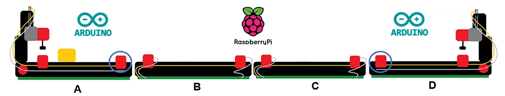

# Distributed Control System using Microcontrollers and Microcomputers - 2021/22

This internship was part of the PIIC curricular unit - Introduction to Scientific Research Program -, in collaboration with the **RICS-UNINOVA** group. The presented work was proposed and oriented by professor André Rocha and researcher Fábio Oliveira, and developed in collaboration with my colleague João Amorim.

The project explored concepts related to intelligent manufacturing and distributed control systems, with the implementation of a real-time system using both microcontrollers and microcomputers, different communication protocols and programming languages. 

    

This was my first contact with the RICS-UNINOVA group which turned out in a great and lasting experience.

Read my Medium article [here](https://medium.com/@altsmpegado/innovating-complex-systems-the-power-of-microcontrollers-50c8fad33a45) and find out more! Or take a look at my [academic report](assets/activities_report.pdf) for a more in depth project walkthrough (PT).